# Modelo Conceptual: Definición de Sistemas e Interconexiones

Este documento define el marco conceptual de GuruShaman, centrado en la estructura del perfil de usuario, la definición de los inputs y las correspondencias cruzadas en forma de red (grafo). Hemos eliminado la especificación física y técnica de bases de datos para enfocarnos puramente en la lógica y el flujo de los sistemas holísticos.

---

## 1. Definición del Perfil de Usuario (Inputs Maestros)

El perfil del usuario recopila un conjunto unificado de datos de entrada (inputs) que son consumidos dinámicamente por los sistemas activos. La siguiente tabla define cada input y qué sistemas dependen de él:

| Parámetro de Entrada (Input) | Tipo de Dato | Propósito General | Sistemas Holísticos que lo Consumen |
|---|---|---|---|
| `fecha_nacimiento` | Fecha | Calcular posiciones celestes, años lunares, senderos de vida y fases biológicas. | Astrología Occidental, Diseño Humano, Astrología China, Numerología, Tzolkin Maya, Astrología Védica, Astrología Kabbalística, Horóscopo Celta, Psicogenealogía, Antroposofía. |
| `hora_nacimiento` | Hora | Determinar el ascendente y la cúspide de casas o centros exactos. | Astrología Occidental, Diseño Humano, Astrología China, Astrología Védica, Astrología Kabbalística. |
| `coordenadas_nacimiento` | Geográfico | Corregir la hora solar verdadera y definir las casas celestes geocéntricas. | Astrología Occidental, Diseño Humano, Astrología China, Astrología Védica, Astrología Kabbalística. |
| `nombre_completo` | Texto | Decodificar el valor vibracional de letras (Gematría / Alfabeto Pitagórico). | Numerología, Astrología Kabbalística, Psicogenealogía. |
| `pregunta_consulta` | Texto | Establecer el marco de consulta oracular del usuario. | Tarot, I Ching, Runas Nórdicas. |
| `extraccion_cartas_runas` | Lista | Mapear los arquetipos de cartas/runas extraídos del mazo físico o digital. | Tarot, Runas Nórdicas. |
| `tirada_valores` | Lista | Formar el hexagrama primario de abajo hacia arriba (valores 6 a 9). | I Ching. |
| `sintomas_fisicos_emocionales`| Lista / Texto | Identificar somatizaciones corporales y bloqueos psicoemocionales. | Sistema de Chakras, Biodescodificación, Flores de Bach. |
| `rasgo_personalidad` | Test / Lista | Determinar temperamento básico e inclinaciones del ego. | Eneagrama de la Personalidad, Flores de Bach, Teosofía. |
| `edad_actual` | Cuantitativo | Identificar el septenio de desarrollo o crisis cronológicas activas. | Antroposofía, Psicogenealogía, Fisiognomía. |
| `arbol_genealogico_datos` | Estructura | Analizar lealtades invisibles a través de fechas y nombres del clan. | Psicogenealogía. |
| `historial_biografico` | Texto / Lista | Mapear hitos vitales cronológicamente para análisis biográfico. | Antroposofía. |
| `estado_materia_reino` | Cualitativo | Evaluar desbalances elementales (Tierra, Aire, Fuego, Agua). | Alquimia y los Cuatro Elementos. |
| `posicion_manos_sesion` | Lista | Indicar la distribución física de flujo de energía en la camilla. | Reiki. |
| `simbolo_activo` | Cualitativo | Seleccionar frecuencias de sintonización (Cho Ku Rei, Sei He Ki, etc.). | Reiki. |
| `intencion_sanacion` | Texto | Declarar el objetivo o decreto de transmutación de la sesión. | Reiki. |
| `mano_lectura_morfologia` | Imagen / Cualitativo | Analizar morfología de palma, dedos y trazado de líneas principales. | Quiromancia. |
| `fotografia_rostro_rasgos` | Imagen / Cualitativo | Evaluar las 3 regiones del rostro, 12 palacios y 100 puntos de edad. | Fisiognomía (Mian Xiang). |
| `estado_presencia` | Cualitativo | Medir el nivel de mecanicismo o autoconciencia en la experiencia. | Eneagrama Sufí. |
| `octava_etapa` | Cualitativo | Evaluar el avance y los puntos de choque de un proceso de vida. | Eneagrama Sufí. |

---

## 2. Grafo de Relaciones: Red de Interconexión Holística

Los sistemas holísticos no operan de manera aislada; se alimentan entre sí formando una red interconectada. A continuación se presenta el **grafo de relaciones cruzadas** que rige el motor de correspondencias de GuruShaman:

```mermaid
graph TD
    %% Nodos
    AO["Astrología Occidental"]
    DH["Diseño Humano"]
    IC["I Ching"]
    TA["Tarot"]
    CA["Cábala / Árbol Vida"]
    NU["Numerología"]
    CH["Sistema de Chakras"]
    AC["Astrología China"]
    RE["Reiki"]
    AL["Alquimia / Elementos"]
    QC["Quiromancia"]
    FS["Fisiognomía / Mian Xiang"]
    BD["Biodescodificación"]
    PG["Psicogenealogía"]
    FB["Flores de Bach"]
    AK["Astrología Kabbalística"]
    HC["Horóscopo Celta"]
    GS["Geometría Sagrada"]
    TE["Teosofía / 7 Rayos"]
    AN["Antroposofía / Septenios"]
    ES["Eneagrama Sufí"]
    EP["Eneagrama Personalidad"]
    TM["Tzolkin Maya"]
    RU["Runas Nórdicas"]
    AV["Astrología Védica (Jyotish)"]
    
    %% Relaciones
    AO -->|Calcula activaciones| DH
    AO -->|Planetas rigen| CH
    AO -->|Signos/Planetas rigen| TA
    AO -->|Regencia de montes| QC
    AO -->|Ciclos planetarios| AN
    AO -->|Transmisores de rayos| TE
    AO -->|12 Curadores| FB
    
    DH -->|64 Puertas = 64 Hexagramas| IC
    DH -->|9 Centros expanden| CH
    DH -->|Centros/Canales = Sephirot/Senderos| CA
    
    TA -->|22 Arcanos = 22 Senderos| CA
    TA -->|Arcanos Menores = Sephirot en 4 Mundos| CA
    
    NU -->|Camino de Vida = Arcano Mayor| TA
    NU -->|Valores numéricos de letras| CA
    
    IC -->|Bagua trigramas = 5 Elementos| AC
    
    CH -->|Localización de síntomas| BD
    CH -->|Imposición de manos| RE
    CH -->|Ascenso elemental| AL
    
    PG -->|Trauma transgeneracional = Síntoma| BD
    PG -->|Repetición de números kármicos| NU
    PG -->|Proyección de arquetipos familiares| TA
    
    AK -->|Meses hebreos = Signos del zodiaco| AO
    AK -->|Letras creadoras = Senderos| CA
    AK -->|Letras hebreas de cartas| TA
    
    HC -->|Meses celtas = Signos del zodiaco| AO
    HC -->|Letras Ogham = Runas germánicas| RU
    HC -->|Árboles protectores = Materia de elixires| FB
    
    AL -->|Correspondencia de 4 elementos| QC
    AL -->|Sal/Mercurio/Azufre = Pensar/Sentir/Hacer| AN
    
    EP -->|Miedos básicos = Esencias florales| FB
    EP -->|Dinámica de movimientos| ES
    
    GS -->|Geometría de aspectos celestes| AO
    GS -->|Sólidos platónicos = Elementos| CH
    GS -->|Trazado del Árbol de la Vida| CA
    
    AV -->|Planetas rigen| CH
    AV -->|Zodiaco sidéreo alternativo| DH

```

---

## 3. Principales Flujos de Datos entre Sistemas

Para entender cómo transita la información en este grafo, definimos los 3 flujos de correlación principales:

### Flujo Cosmobiológico (Nacimiento -> Estructura)
El usuario ingresa sus datos natales (`fecha`, `hora`, `coordenadas`) y el sistema activa el siguiente encadenamiento:
1.  **Astrología Occidental / Védica** calcula las efemérides planetarias.
2.  Las efemérides alimentan a **Diseño Humano**, activando las puertas del BodyGraph.
3.  Las puertas activadas llaman a los hexagramas correspondientes del **I Ching**.
4.  Los centros definidos resultantes en Diseño Humano reordenan el balance energético de los **Chakras** corporales.
5.  Los chakras indican la predisposición de temperamento en **Reiki** y las zonas críticas a vigilar.

### Flujo Psicosomático y Terapéutico (Síntoma -> Remedio)
El usuario reporta un síntoma físico recurrente o un estado emocional:
1.  **Biodescodificación** mapea el `sintoma_fisico` a su correspondiente conflicto biológico y capa embrionaria.
2.  El síntoma se localiza en un área del cuerpo regulada por un **Chakra** específico.
3.  El desbalance del chakra se cruza con las debilidades del eneatipo en el **Eneagrama de la Personalidad**.
4.  El eneatipo y el conflicto emocional derivan en una fórmula combinada de **Flores de Bach** para armonizar la personalidad.

### Flujo Místico e Iniciático (Nombre -> Destino)
El usuario ingresa su `nombre_completo` de nacimiento:
1.  **Numerología** calcula su Número de Expresión y Sendero de Vida.
2.  El Sendero de Vida se asocia con el Arcano Mayor del **Tarot** que describe sus pruebas de aprendizaje.
3.  La letra hebrea del nombre o el mes hebreo natal de la **Astrología Kabbalística** mapea el sendero activo en el **Árbol de la Vida** (Cábala), indicando qué cualidades espirituales (*Sefirot*) debe equilibrar el alma en su retorno consciente.
