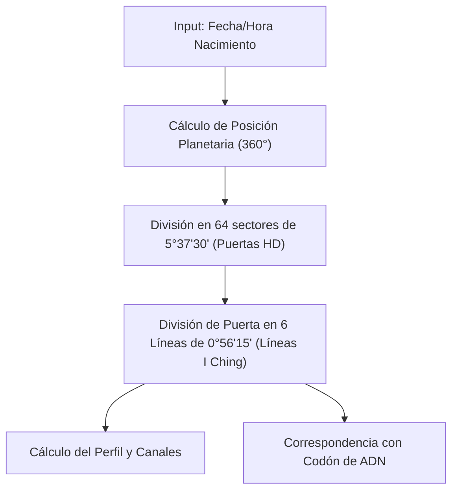

# Matriz de Relaciones Cruzadas e Interconexiones

Este documento detalla los principales puntos de intersección y correspondencias lógicas tradicionales y modernas entre los 25 sistemas holísticos del benchmark de GuruShaman. Estos cruces actúan como la lógica de correlación de datos (reglas de mapeo) en nuestro motor unificado.

---

## 1. Mapeo Principal: Correspondencias Clave

La siguiente tabla resume las intersecciones más relevantes entre las variables de distintos sistemas:

| Sistema Origen | Variable Origen | Sistema Destino | Variable Destino | Tipo de Correspondencia | Descripción |
|---|---|---|---|---|---|
| **Diseño Humano** | `puerta_activacion` | **I Ching** | `hexagrama_primario` | Biyectiva (1 a 1) | Las 64 puertas del BodyGraph corresponden de forma exacta a los 64 hexagramas del I Ching. Las 6 líneas de la puerta equivalen a las 6 líneas del hexagrama. |
| **Astrología Occidental** | `planeta_posicion` | **Diseño Humano** | `puerta_activacion` | Algorítmica (Cálculo) | Las posiciones angulares de los planetas en el zodíaco tropical (0° Aries a 30° Piscis) se mapean en sectores de 5°37'30" que definen la activación de puertas específicas. |
| **Tarot** | `carta_arcano_mayor` | **Cábala** | `sendero_conexion` | Biyectiva (1 a 1) | Los 22 Arcanos Mayores corresponden a los 22 senderos de conexión entre las Sefirot, compartiendo la misma letra hebrea y vibración. |
| **Tarot** | `carta_arcano_mayor` | **Astrología Occidental** | `planeta_posicion` / `ascendente` | Estática (Mapeo) | Cada arcano representa un signo del zodiaco o un planeta (ej. El Loco = Urano; El Emperador = Aries; El Mundo = Saturno). |
| **Tarot** | `carta_arcano_menor` | **Cábala** | `sefira_activacion` | Estática / Grupal | Los números del As al 10 en los cuatro palos representan la manifestación de las 10 Sefirot en los 4 mundos cabalísticos (ej. Ases = Kéter; Dieces = Malkuth). |
| **Numerología** | `sendero_vida` / `expresion` | **Tarot** | `numero_carta` (Arcano Mayor) | Estática (Reducción) | La vibración numérica reducida del 1 al 9, 11 y 22 conecta directamente con el significado arquetípico del arcano correspondiente (ej. 1 = El Mago; 9 = El Ermitaño). |
| **Astrología Occidental** | `planeta_posicion` (Regencias) | **Sistema de Chakras** | `chakra_estado` | Estática (Gobernanza) | Los planetas tradicionales gobiernan y canalizan su energía en chakras específicos (ej. Sol = Plexo Solar; Saturno = Raíz; Mercurio = Garganta). |
| **Diseño Humano** | `centro_definicion` | **Sistema de Chakras** | `chakra_estado` | Expansiva (Mapeo) | Los 9 centros del BodyGraph reorganizan los 7 chakras clásicos (el Corazón se divide en Ego y G; el Plexo Solar se divide en Bazo y Plexo Solar emocional). |
| **Eneagrama** | `eneatipo_principal` | **Flores de Bach** | `remedio_floral` | Estática (Carácter) | Las fijaciones y miedos básicos de los 9 eneatipos se asocian a flores que equilibran dicho estado emocional (ej. 2 = Chicory; 5 = Water Violet; 6 = Mimulus). |
| **Biodescodificación** | `sintoma_fisico` (Órgano) | **Sistema de Chakras** | `chakra_estado` | Somática (Mapeo) | La ubicación del síntoma físico coincide con el área corporal de influencia del chakra correspondiente (ej. tiroiditis = Garganta; colitis = Sacro/Raíz). |
| **Psicogenealogía** | `linea_afinidad` | **Biodescodificación** | `sintoma_fisico` | Transgeneracional | Un trauma heredado inconscientemente por afinidad de fecha/nombre ("doble") se activa como un síntoma de biodescodificación en la vida del descendiente. |
| **Alquimia** | `cuatro_elementos` | **Quiromancia** | `tipo_mano_elemento` | Biyectiva (Mapeo) | La morfología y proporción de la mano clasifica el temperamento según los 4 elementos (Mano de Fuego, Tierra, Aire, Agua). |
| **Alquimia** | `tres_principios` | **Antroposofía** | `actividad_tripartita` | Funcional (Mapeo) | Sal = Pensar (estructura/neurosensorial); Mercurio = Sentir (rítmico/mediador); Azufre = Querer/Hacer (combustión/motor). |
| **Astrología Kabbalística**| `mes_hebreo` | **Astrología Occidental** | `planeta_posicion` / `casa_cuspide`| Biyectiva (Calendario) | Mapeo directo entre los 12 meses lunares del calendario hebreo y las 12 constelaciones del zodiaco solar occidental (ej. Nisán = Aries). |

---

## 2. Detalles de Lógica de Intersección Multidireccional

### A. La Conexión Astrología -> Diseño Humano -> I Ching -> ADN
Esta es una de las relaciones matemáticas más fascinantes y precisas del misticismo moderno:
1.  **Input**: Fecha, hora y lugar de nacimiento.
2.  **Cálculo Astrológico**: Se calculan las posiciones eclípticas exactas (en grados, minutos y segundos de longitud zodiacal) de 13 cuerpos celestes y nodos lunares.
3.  **Mapeo de Rueda**: El círculo del zodiaco de 360° se divide en 64 sectores iguales de **5° 37' 30"** cada uno. Cada sector corresponde a una de las 64 Puertas de Diseño Humano.
4.  **Mapeo I Ching**: La puerta activada representa el hexagrama del I Ching. Los minutos e incrementos dentro de los 5°37'30" determinan la Línea del hexagrama (de la 1 a la 6), correspondiendo a un arco exacto de **0° 56' 15"** por línea.
5.  **Mapeo Biológico**: La estructura binaria de 64 hexagramas y 6 líneas equivale lógicamente a las combinaciones de codones (tripletes de aminoácidos) en el código genético humano (ej. Puerta 56 = Codón de parada; Puerta 3 = Codón de inicio).

### B. El Eje Psicosomático (Cábala - Chakras - Biodescodificación - Flores de Bach)
Cuando un consultante presenta una condición física o un conflicto existencial, el sistema puede rastrearlo a través de múltiples dimensiones:
1.  **El Síntoma**: ` eccema en el pecho ` (problema de piel en zona pectoral).
2.  **Capa Embrionaria (Biodescodificación)**: Ectodermo (conflicto de separación / contacto deseado o no deseado en el territorio).
3.  **Localización de Chakras**: Zona pectoral = **Anahata (Chakra Corazón)**, que rige la capacidad de amar, dar, recibir y la conexión con las relaciones íntimas.
4.  **Sefirá Asociada (Cábala)**: **Tiferet (Belleza / Corazón)**, el punto de armonización del pilar central del Árbol de la Vida.
5.  **Terapia Floral (Flores de Bach)**: Para tratar el conflicto de separación y protección del corazón se recetan esencias como *Holly* (amor incondicional frente a la ira/sospecha por separación) y *Chicory* (apego posesivo).
6.  **Eneagrama**: Este conflicto suele resonar con la herida del Eneatipo 2 (necesidad de amor y pavor a la separación/rechazo) o Eneatipo 9 (evitar la confrontación y separación a toda costa).

